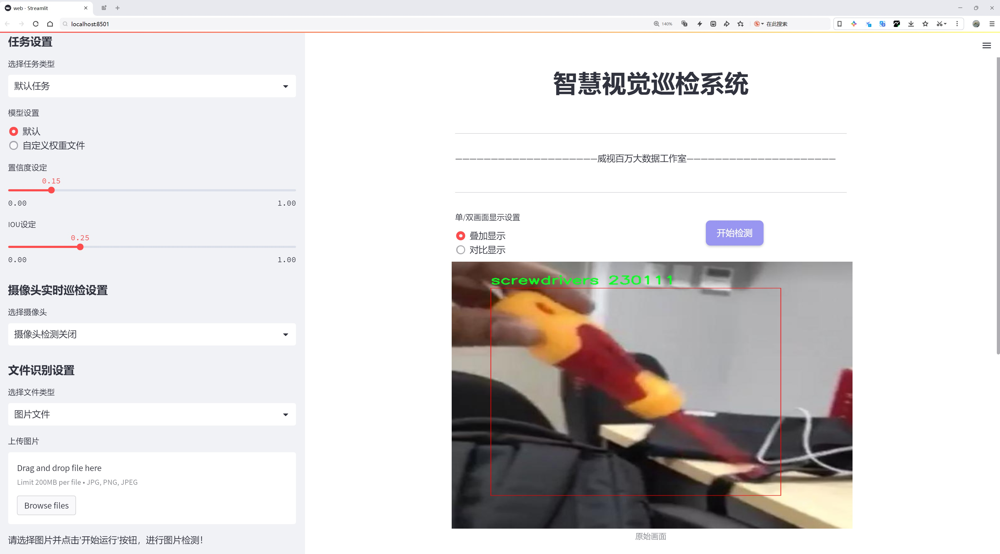
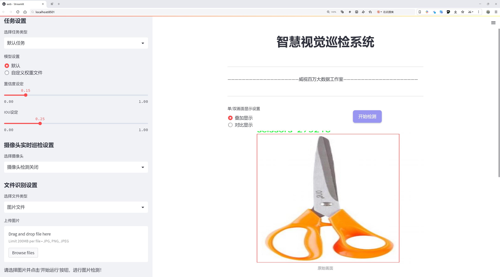
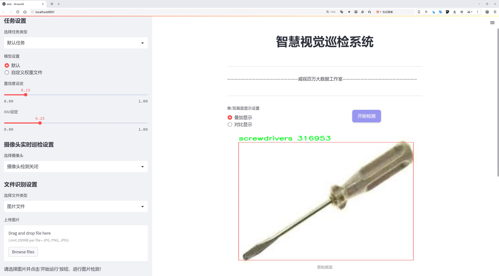
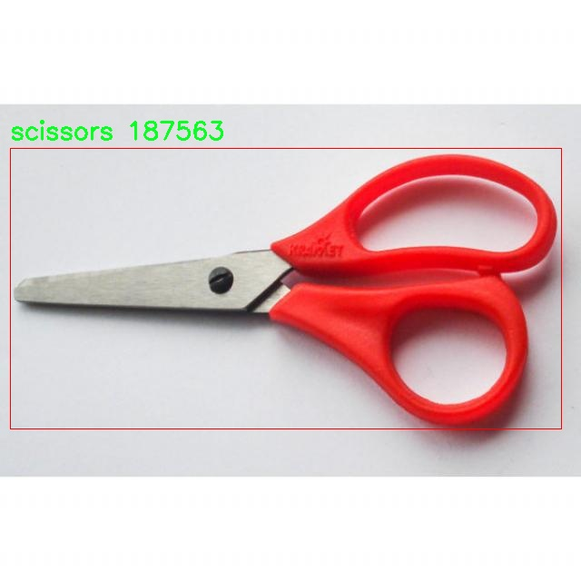
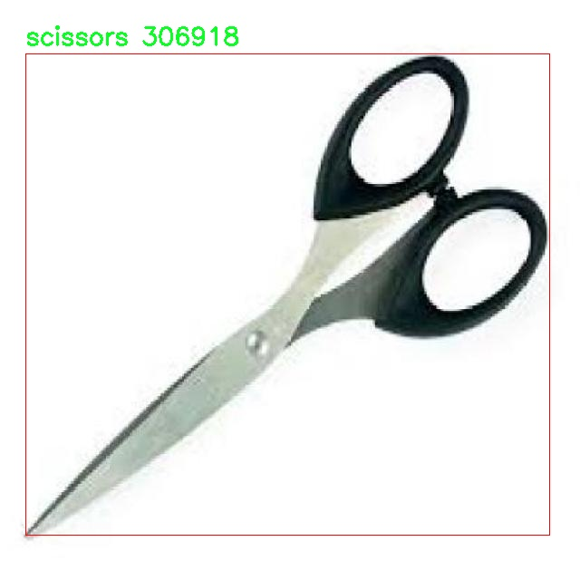
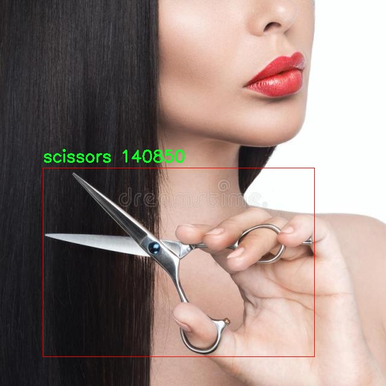
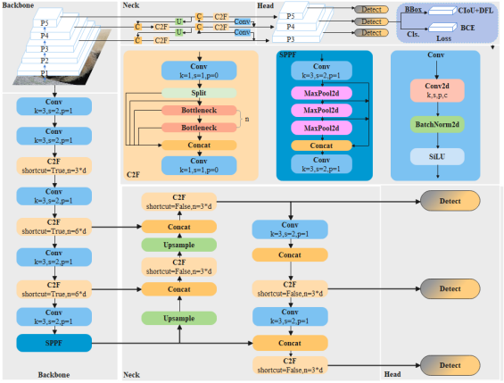

# 工具检测检测系统源码分享
 # [一条龙教学YOLOV8标注好的数据集一键训练_70+全套改进创新点发刊_Web前端展示]

### 1.研究背景与意义

项目参考[AAAI Association for the Advancement of Artificial Intelligence](https://gitee.com/qunmasj/projects)

项目来源[AACV Association for the Advancement of Computer Vision](https://kdocs.cn/l/cszuIiCKVNis)

研究背景与意义

随着工业自动化和智能制造的迅速发展，工具检测系统在生产和维护领域的应用日益广泛。传统的工具管理方法往往依赖人工检查和记录，效率低下且容易出错，难以满足现代化生产对实时性和准确性的要求。因此，基于计算机视觉的自动化工具检测系统应运而生，成为提升生产效率和降低人力成本的重要手段。近年来，深度学习技术的飞速发展，尤其是目标检测算法的不断优化，为工具检测系统的构建提供了强有力的技术支持。

YOLO（You Only Look Once）系列模型因其高效的实时检测能力和较高的准确率，成为目标检测领域的热门选择。YOLOv8作为该系列的最新版本，进一步提升了模型的性能，具备了更快的推理速度和更强的特征提取能力。然而，尽管YOLOv8在多种应用场景中表现出色，但在特定领域如工具检测时，仍然面临着一些挑战。例如，工具的外观相似性、光照变化、背景复杂性等因素，可能导致模型的检测精度下降。因此，针对特定工具类别进行模型的改进和优化，具有重要的研究价值。

本研究基于YOLOv8模型，针对特定的工具类别（如钳子、剪刀和螺丝刀）进行改进，旨在构建一个高效、准确的工具检测系统。我们使用的数据集包含3500张图像，涵盖了三种工具类别，提供了丰富的样本数据。这一数据集的构建不仅为模型训练提供了基础，还为后续的模型评估和优化提供了可靠的依据。通过对数据集的深入分析，我们可以识别出工具检测中可能存在的困难和挑战，从而为模型的改进提供方向。

本研究的意义在于，不仅能够推动工具检测技术的发展，还能够为工业界提供切实可行的解决方案。通过改进YOLOv8模型，我们期望能够显著提高工具检测的准确性和实时性，进而提升生产线的自动化水平。此外，成功的工具检测系统还可以为后续的智能化管理提供数据支持，促进工业4.0的实现。

综上所述，基于改进YOLOv8的工具检测系统的研究，不仅具有重要的理论意义，还具有广泛的应用前景。通过对特定工具类别的深入研究，我们希望能够为工具检测领域提供新的思路和方法，推动相关技术的进步与应用，为实现更高效的生产管理提供有力支持。

### 2.图片演示







##### 注意：由于此博客编辑较早，上面“2.图片演示”和“3.视频演示”展示的系统图片或者视频可能为老版本，新版本在老版本的基础上升级如下：（实际效果以升级的新版本为准）

  （1）适配了YOLOV8的“目标检测”模型和“实例分割”模型，通过加载相应的权重（.pt）文件即可自适应加载模型。

  （2）支持“图片识别”、“视频识别”、“摄像头实时识别”三种识别模式。

  （3）支持“图片识别”、“视频识别”、“摄像头实时识别”三种识别结果保存导出，解决手动导出（容易卡顿出现爆内存）存在的问题，识别完自动保存结果并导出到tempDir中。

  （4）支持Web前端系统中的标题、背景图等自定义修改，后面提供修改教程。

  另外本项目提供训练的数据集和训练教程,暂不提供权重文件（best.pt）,需要您按照教程进行训练后实现图片演示和Web前端界面演示的效果。

### 3.视频演示

[3.1 视频演示](https://www.bilibili.com/video/BV17zxge7ETF/)

### 4.数据集信息展示

##### 4.1 本项目数据集详细数据（类别数＆类别名）

nc: 3
names: ['pliers', 'scissors', 'screwdrivers']


##### 4.2 本项目数据集信息介绍

数据集信息展示

在现代计算机视觉领域，数据集的构建与选择对模型的训练和性能优化至关重要。本次研究所采用的数据集名为“test5”，专门用于训练和改进YOLOv8工具检测系统。该数据集的设计旨在提升模型在特定工具检测任务中的准确性和鲁棒性，尤其是在复杂环境下的表现。数据集“test5”包含了三种主要类别的工具，分别是钳子（pliers）、剪刀（scissors）和螺丝刀（screwdrivers），这些工具在日常生活和工业应用中具有广泛的使用场景。

数据集的类别数量为3，且每个类别的样本数量经过精心挑选，以确保模型在训练过程中能够获得充分的学习信号。具体而言，钳子作为一种常见的手动工具，通常用于夹持、扭转和切割等操作，其外观和使用方式多样，因此在数据集中包含了多种不同类型和品牌的钳子，以提高模型的泛化能力。剪刀则是另一种重要的工具，广泛应用于家庭和办公环境，其设计和形状的多样性使得剪刀在视觉识别中具有一定的挑战性。最后，螺丝刀作为一种基础的维修工具，种类繁多，包括十字螺丝刀和一字螺丝刀等，这些不同类型的螺丝刀在数据集中同样得到了充分的体现。

在数据集“test5”的构建过程中，数据采集和标注环节尤为重要。为了确保数据的多样性和代表性，研究团队在不同的环境中拍摄了大量的工具图像，包括自然光照、不同背景和不同角度等条件下的样本。这种多样化的采集方式使得数据集能够更好地模拟实际应用场景，从而提高YOLOv8模型在真实世界中的适应能力。此外，所有图像均经过严格的标注，确保每个工具的边界框准确无误，这对于训练深度学习模型至关重要。

在数据预处理阶段，研究团队对图像进行了标准化处理，包括调整图像尺寸、增强对比度和亮度等，以提高模型的训练效率和检测精度。同时，为了避免模型过拟合，数据集还采用了数据增强技术，通过旋转、翻转和随机裁剪等方式生成更多的训练样本，从而丰富数据集的多样性。

通过对数据集“test5”的深入分析与应用，研究团队期望能够显著提升YOLOv8在工具检测任务中的性能。随着模型的不断训练与优化，预计其在工具识别的准确率、召回率等指标上都将实现显著提升，为后续的实际应用奠定坚实的基础。总之，数据集“test5”不仅为YOLOv8模型的训练提供了丰富的样本支持，也为未来的工具检测研究开辟了新的方向。









### 5.全套项目环境部署视频教程（零基础手把手教学）

[5.1 环境部署教程链接（零基础手把手教学）](https://www.ixigua.com/7404473917358506534?logTag=c807d0cbc21c0ef59de5)


[5.2 安装Python虚拟环境创建和依赖库安装视频教程链接（零基础手把手教学）](https://www.ixigua.com/7404474678003106304?logTag=1f1041108cd1f708b01a)

### 6.手把手YOLOV8训练视频教程（零基础小白有手就能学会）

[6.1 手把手YOLOV8训练视频教程（零基础小白有手就能学会）](https://www.ixigua.com/7404477157818401292?logTag=d31a2dfd1983c9668658)

### 7.70+种全套YOLOV8创新点代码加载调参视频教程（一键加载写好的改进模型的配置文件）

[7.1 70+种全套YOLOV8创新点代码加载调参视频教程（一键加载写好的改进模型的配置文件）](https://www.ixigua.com/7404478314661806627?logTag=29066f8288e3f4eea3a4)

### 8.70+种全套YOLOV8创新点原理讲解（非科班也可以轻松写刊发刊，V10版本正在科研待更新）

由于篇幅限制，每个创新点的具体原理讲解就不一一展开，具体见下列网址中的创新点对应子项目的技术原理博客网址【Blog】：


[8.1 70+种全套YOLOV8创新点原理讲解链接](https://gitee.com/qunmasj/good)

### 9.系统功能展示（检测对象为举例，实际内容以本项目数据集为准）

图9.1.系统支持检测结果表格显示

  图9.2.系统支持置信度和IOU阈值手动调节

  图9.3.系统支持自定义加载权重文件best.pt(需要你通过步骤5中训练获得)

  图9.4.系统支持摄像头实时识别

  图9.5.系统支持图片识别

  图9.6.系统支持视频识别

  图9.7.系统支持识别结果文件自动保存

  图9.8.系统支持Excel导出检测结果数据


### 10.原始YOLOV8算法原理

原始YOLOv8算法原理

YOLOv8算法作为YOLO系列的最新成员，延续了YOLOv5和YOLOv7的优良传统，并在此基础上进行了多项创新和改进，旨在实现更高效、更准确的目标检测。该算法的架构依然由输入层、主干网络、特征融合层和解耦头组成，然而其内部的细节和设计理念却展现出更为深刻的技术进步。

在主干网络部分，YOLOv8继续采用了CSPDarknet的设计理念，这一思想通过跨阶段部分连接（Cross Stage Partial connections）有效地缓解了深层网络中的梯度消失问题。在YOLOv8中，C3模块被更为轻量化的C2f模块所替代，C2f模块不仅保持了高效的特征提取能力，还通过引入ELAN（Efficient Layer Aggregation Network）思想，增强了特征的重用性。C2f模块的设计允许网络在提取特征时，形成两个分支，分别进行不同的特征处理，最终将其融合。这种结构的优势在于，能够在保证检测精度的同时，显著降低模型的复杂度和计算量，使得YOLOv8在资源受限的环境中依然能够高效运行。

在特征融合层，YOLOv8采用了PAN-FPN（Path Aggregation Network - Feature Pyramid Network）结构，进一步提升了多尺度特征的融合能力。与YOLOv5相比，YOLOv8在上采样阶段去掉了1x1卷积层，这一设计简化了网络结构，同时保持了特征的完整性和准确性。通过自下而上的特征融合，YOLOv8能够有效整合来自不同层次的特征信息，从而更好地捕捉到目标的细节和语义信息。

值得注意的是，YOLOv8在目标检测中引入了Anchor-Free的思想，摒弃了传统的Anchor-Based方法。这一转变使得模型在处理目标时不再依赖于预定义的锚框，从而降低了对锚框设计的依赖性和复杂性。这种Anchor-Free的设计理念，使得YOLOv8在处理小目标和复杂场景时，表现出更高的灵活性和适应性。

在损失函数的设计上，YOLOv8采用了VFLLoss和DFLLoss+CIoULoss的组合策略，针对分类和边界框回归任务进行优化。这种新的损失函数不仅考虑了分类的准确性，还引入了对边界框的更高精度要求，确保了检测结果的可靠性。此外，YOLOv8在样本匹配策略上也进行了创新，将静态匹配改为Task-Aligned的Assigner匹配方式，进一步提升了模型在训练过程中的样本利用效率。

数据预处理方面，YOLOv8借鉴了YOLOv5的策略，采用了包括马赛克增强、混合增强、空间扰动和颜色扰动等多种数据增强手段。这些增强手段有效地提升了模型的鲁棒性，使得YOLOv8在面对复杂和多变的场景时，依然能够保持较高的检测精度。

YOLOv8的Head部分同样经过了精心设计，采用了解耦的结构，使得分类和回归任务能够独立进行。通过输出三个不同尺度的特征图，YOLOv8能够在多种尺寸下对目标进行检测，确保了对不同大小目标的良好适应性。此外，Head部分的输出通过使用Softmax和Conv计算，将特征图转换为真实的边界框格式，从而实现目标的准确定位和分类。

综上所述，YOLOv8算法在多个方面进行了创新和优化，从主干网络到特征融合层，再到损失函数和样本匹配策略，均展现出其在目标检测领域的强大能力。通过轻量化的设计和高效的特征提取，YOLOv8不仅提升了检测精度，也降低了计算复杂度，使其在实际应用中具备了更广泛的适用性。随着YOLOv8的推出，目标检测技术将迎来新的发展机遇，为各类应用场景提供更加智能和高效的解决方案。



### 11.项目核心源码讲解（再也不用担心看不懂代码逻辑）

#### 11.1 code\ultralytics\data\build.py

以下是对代码的核心部分进行分析和详细注释的结果：

```python
import os
import random
from pathlib import Path
import numpy as np
import torch
from torch.utils.data import dataloader, distributed
from ultralytics.data.loaders import LoadImages, LoadStreams, LoadTensor, SourceTypes
from ultralytics.utils import RANK
from .dataset import YOLODataset
from .utils import PIN_MEMORY

class InfiniteDataLoader(dataloader.DataLoader):
    """
    无限循环的数据加载器，重用工作线程。
    继承自 PyTorch 的 DataLoader。
    """

    def __init__(self, *args, **kwargs):
        """初始化无限数据加载器，设置重复采样器。"""
        super().__init__(*args, **kwargs)
        object.__setattr__(self, "batch_sampler", _RepeatSampler(self.batch_sampler))
        self.iterator = super().__iter__()

    def __len__(self):
        """返回批采样器的长度。"""
        return len(self.batch_sampler.sampler)

    def __iter__(self):
        """创建一个无限重复的迭代器。"""
        for _ in range(len(self)):
            yield next(self.iterator)

    def reset(self):
        """重置迭代器，便于在训练过程中修改数据集设置。"""
        self.iterator = self._get_iterator()

class _RepeatSampler:
    """
    无限重复的采样器。
    """

    def __init__(self, sampler):
        """初始化一个无限重复的采样器。"""
        self.sampler = sampler

    def __iter__(self):
        """无限迭代给定的采样器。"""
        while True:
            yield from iter(self.sampler)

def seed_worker(worker_id):
    """设置数据加载器工作线程的随机种子。"""
    worker_seed = torch.initial_seed() % 2**32
    np.random.seed(worker_seed)
    random.seed(worker_seed)

def build_yolo_dataset(cfg, img_path, batch, data, mode="train", rect=False, stride=32):
    """构建 YOLO 数据集。"""
    return YOLODataset(
        img_path=img_path,
        imgsz=cfg.imgsz,  # 图像大小
        batch_size=batch,  # 批大小
        augment=mode == "train",  # 是否进行数据增强
        hyp=cfg,  # 超参数配置
        rect=cfg.rect or rect,  # 是否使用矩形批次
        cache=cfg.cache or None,  # 缓存设置
        single_cls=cfg.single_cls or False,  # 是否单类检测
        stride=int(stride),  # 步幅
        pad=0.0 if mode == "train" else 0.5,  # 填充
        prefix=colorstr(f"{mode}: "),  # 模式前缀
        task=cfg.task,  # 任务类型
        classes=cfg.classes,  # 类别
        data=data,  # 数据集信息
        fraction=cfg.fraction if mode == "train" else 1.0,  # 训练时的数据比例
    )

def build_dataloader(dataset, batch, workers, shuffle=True, rank=-1):
    """返回用于训练或验证集的 InfiniteDataLoader 或 DataLoader。"""
    batch = min(batch, len(dataset))  # 确保批大小不超过数据集大小
    nd = torch.cuda.device_count()  # CUDA 设备数量
    nw = min([os.cpu_count() // max(nd, 1), workers])  # 工作线程数量
    sampler = None if rank == -1 else distributed.DistributedSampler(dataset, shuffle=shuffle)  # 分布式采样器
    generator = torch.Generator()
    generator.manual_seed(6148914691236517205 + RANK)  # 设置随机种子
    return InfiniteDataLoader(
        dataset=dataset,
        batch_size=batch,
        shuffle=shuffle and sampler is None,  # 如果没有采样器，则打乱数据
        num_workers=nw,  # 工作线程数量
        sampler=sampler,  # 采样器
        pin_memory=PIN_MEMORY,  # 是否将数据固定在内存中
        collate_fn=getattr(dataset, "collate_fn", None),  # 合并函数
        worker_init_fn=seed_worker,  # 工作线程初始化函数
        generator=generator,  # 随机数生成器
    )

def check_source(source):
    """检查输入源类型并返回相应的标志值。"""
    webcam, screenshot, from_img, in_memory, tensor = False, False, False, False, False
    if isinstance(source, (str, int, Path)):  # 支持字符串、整数和路径
        source = str(source)
        is_file = Path(source).suffix[1:] in (IMG_FORMATS + VID_FORMATS)  # 检查是否为文件
        is_url = source.lower().startswith(("https://", "http://", "rtsp://", "rtmp://", "tcp://"))  # 检查是否为URL
        webcam = source.isnumeric() or source.endswith(".streams") or (is_url and not is_file)  # 判断是否为摄像头
        screenshot = source.lower() == "screen"  # 判断是否为屏幕截图
    elif isinstance(source, LOADERS):
        in_memory = True  # 内存中的数据
    elif isinstance(source, (list, tuple)):
        source = autocast_list(source)  # 转换列表元素为 PIL 或 np 数组
        from_img = True
    elif isinstance(source, (Image.Image, np.ndarray)):
        from_img = True  # 从图像加载
    elif isinstance(source, torch.Tensor):
        tensor = True  # 从张量加载
    else:
        raise TypeError("不支持的图像类型。")

    return source, webcam, screenshot, from_img, in_memory, tensor

def load_inference_source(source=None, imgsz=640, vid_stride=1, buffer=False):
    """
    加载用于目标检测的推理源并应用必要的转换。
    """
    source, webcam, screenshot, from_img, in_memory, tensor = check_source(source)  # 检查源类型
    # 根据源类型加载数据集
    if tensor:
        dataset = LoadTensor(source)
    elif in_memory:
        dataset = source
    elif webcam:
        dataset = LoadStreams(source, imgsz=imgsz, vid_stride=vid_stride, buffer=buffer)
    elif screenshot:
        dataset = LoadScreenshots(source, imgsz=imgsz)
    elif from_img:
        dataset = LoadPilAndNumpy(source, imgsz=imgsz)
    else:
        dataset = LoadImages(source, imgsz=imgsz, vid_stride=vid_stride)

    return dataset  # 返回加载的数据集
```

### 代码分析总结
1. **InfiniteDataLoader**: 这是一个自定义的数据加载器，能够无限循环地提供数据，适合于训练过程中的数据增强和动态调整。
2. **_RepeatSampler**: 这个类用于创建一个可以无限重复的采样器，确保在训练过程中数据的持续可用性。
3. **数据集构建**: `build_yolo_dataset` 和 `build_dataloader` 函数用于创建 YOLO 数据集和相应的数据加载器，支持多种配置选项。
4. **源检查**: `check_source` 函数用于验证输入源的类型，并返回相应的标志，支持多种数据源（如文件、URL、摄像头等）。
5. **推理源加载**: `load_inference_source` 函数根据输入源类型加载相应的数据集，准备进行目标检测推理。

该文件是Ultralytics YOLO项目中的一个数据构建模块，主要用于处理数据加载和预处理的功能。文件中包含多个类和函数，主要用于构建YOLO数据集和数据加载器。

首先，文件导入了一些必要的库，包括操作系统相关的库、随机数生成库、路径处理库、NumPy、PyTorch及其相关模块、PIL图像处理库等。接着，导入了YOLO相关的数据加载器和工具函数。

在这个文件中，`InfiniteDataLoader`类是一个自定义的数据加载器，继承自PyTorch的`DataLoader`。它的特点是可以无限循环使用工作线程，这对于训练过程中的数据加载非常有用。该类重写了`__len__`和`__iter__`方法，使得每次迭代都能返回新的数据批次。`reset`方法允许在训练过程中重置迭代器，以便可以在修改数据集设置时重新开始加载数据。

`_RepeatSampler`类是一个辅助类，用于实现无限重复的采样器。它接受一个采样器并在迭代时不断返回其内容。

`seed_worker`函数用于设置数据加载器工作线程的随机种子，以确保每次训练时数据的随机性可控。

`build_yolo_dataset`函数用于构建YOLO数据集。它接受配置参数、图像路径、批次大小等信息，并返回一个`YOLODataset`对象。这个函数支持数据增强、单类训练、缓存等功能，能够根据训练模式的不同进行相应的设置。

`build_dataloader`函数则用于返回一个`InfiniteDataLoader`或`DataLoader`，用于训练或验证集。它根据可用的CUDA设备数量和工作线程数量来配置数据加载器，并设置随机种子。

`check_source`函数用于检查输入源的类型，并返回相应的标志值。这包括检查输入是否为文件、URL、摄像头、图像、张量等，并根据类型进行相应的处理。

最后，`load_inference_source`函数用于加载推理源，并应用必要的转换。它接受输入源、图像大小、视频帧间隔等参数，返回一个数据集对象。该函数会根据输入源的类型选择合适的数据加载方式。

整体来看，这个文件的主要功能是为YOLO模型的训练和推理提供灵活的数据加载和处理机制，确保在不同的输入源和训练模式下都能高效地处理数据。

#### 11.2 code\ultralytics\models\yolo\pose\val.py

以下是代码中最核心的部分，并附上详细的中文注释：

```python
class PoseValidator(DetectionValidator):
    """
    PoseValidator类扩展了DetectionValidator类，用于基于姿态模型的验证。
    """

    def __init__(self, dataloader=None, save_dir=None, pbar=None, args=None, _callbacks=None):
        """初始化PoseValidator对象，设置自定义参数和属性。"""
        super().__init__(dataloader, save_dir, pbar, args, _callbacks)  # 调用父类构造函数
        self.sigma = None  # 用于计算关键点的标准差
        self.kpt_shape = None  # 关键点的形状
        self.args.task = "pose"  # 设置任务类型为姿态估计
        self.metrics = PoseMetrics(save_dir=self.save_dir, on_plot=self.on_plot)  # 初始化姿态度量
        if isinstance(self.args.device, str) and self.args.device.lower() == "mps":
            LOGGER.warning(
                "WARNING ⚠️ Apple MPS known Pose bug. Recommend 'device=cpu' for Pose models."
            )

    def preprocess(self, batch):
        """预处理批次，将'keypoints'数据转换为浮点数并移动到设备上。"""
        batch = super().preprocess(batch)  # 调用父类的预处理方法
        batch["keypoints"] = batch["keypoints"].to(self.device).float()  # 转换关键点数据类型
        return batch

    def postprocess(self, preds):
        """应用非极大值抑制，返回高置信度的检测结果。"""
        return ops.non_max_suppression(
            preds,
            self.args.conf,
            self.args.iou,
            labels=self.lb,
            multi_label=True,
            agnostic=self.args.single_cls,
            max_det=self.args.max_det,
            nc=self.nc,
        )

    def update_metrics(self, preds, batch):
        """更新度量指标。"""
        for si, pred in enumerate(preds):
            self.seen += 1  # 记录已处理的样本数量
            npr = len(pred)  # 当前预测的数量
            stat = dict(
                conf=torch.zeros(0, device=self.device),
                pred_cls=torch.zeros(0, device=self.device),
                tp=torch.zeros(npr, self.niou, dtype=torch.bool, device=self.device),
                tp_p=torch.zeros(npr, self.niou, dtype=torch.bool, device=self.device),
            )
            pbatch = self._prepare_batch(si, batch)  # 准备当前批次数据
            cls, bbox = pbatch.pop("cls"), pbatch.pop("bbox")  # 提取类别和边界框
            nl = len(cls)  # 真实类别数量
            stat["target_cls"] = cls  # 保存真实类别

            if npr == 0:  # 如果没有预测结果
                if nl:
                    for k in self.stats.keys():
                        self.stats[k].append(stat[k])  # 更新统计信息
                continue

            predn, pred_kpts = self._prepare_pred(pred, pbatch)  # 准备预测结果
            stat["conf"] = predn[:, 4]  # 置信度
            stat["pred_cls"] = predn[:, 5]  # 预测类别

            if nl:  # 如果有真实标签
                stat["tp"] = self._process_batch(predn, bbox, cls)  # 处理批次以计算真正例
                stat["tp_p"] = self._process_batch(predn, bbox, cls, pred_kpts, pbatch["kpts"])  # 处理关键点
            for k in self.stats.keys():
                self.stats[k].append(stat[k])  # 更新统计信息

    def _process_batch(self, detections, gt_bboxes, gt_cls, pred_kpts=None, gt_kpts=None):
        """
        返回正确的预测矩阵。
        """
        if pred_kpts is not None and gt_kpts is not None:
            area = ops.xyxy2xywh(gt_bboxes)[:, 2:].prod(1) * 0.53  # 计算区域
            iou = kpt_iou(gt_kpts, pred_kpts, sigma=self.sigma, area=area)  # 计算关键点的IoU
        else:  # 处理边界框
            iou = box_iou(gt_bboxes, detections[:, :4])  # 计算边界框的IoU

        return self.match_predictions(detections[:, 5], gt_cls, iou)  # 匹配预测与真实标签

    def plot_val_samples(self, batch, ni):
        """绘制并保存验证集样本，显示预测的边界框和关键点。"""
        plot_images(
            batch["img"],
            batch["batch_idx"],
            batch["cls"].squeeze(-1),
            batch["bboxes"],
            kpts=batch["keypoints"],
            paths=batch["im_file"],
            fname=self.save_dir / f"val_batch{ni}_labels.jpg",
            names=self.names,
            on_plot=self.on_plot,
        )

    def eval_json(self, stats):
        """使用COCO JSON格式评估目标检测模型。"""
        if self.args.save_json and self.is_coco and len(self.jdict):
            anno_json = self.data["path"] / "annotations/person_keypoints_val2017.json"  # 注释文件路径
            pred_json = self.save_dir / "predictions.json"  # 预测结果文件路径
            LOGGER.info(f"\nEvaluating pycocotools mAP using {pred_json} and {anno_json}...")
            try:
                check_requirements("pycocotools>=2.0.6")  # 检查pycocotools依赖
                from pycocotools.coco import COCO  # 导入COCO API
                from pycocotools.cocoeval import COCOeval  # 导入COCO评估API

                for x in anno_json, pred_json:
                    assert x.is_file(), f"{x} file not found"  # 确保文件存在
                anno = COCO(str(anno_json))  # 初始化注释API
                pred = anno.loadRes(str(pred_json))  # 初始化预测API
                for i, eval in enumerate([COCOeval(anno, pred, "bbox"), COCOeval(anno, pred, "keypoints")]):
                    eval.evaluate()  # 评估
                    eval.accumulate()  # 累积结果
                    eval.summarize()  # 总结结果
                    idx = i * 4 + 2
                    stats[self.metrics.keys[idx + 1]], stats[self.metrics.keys[idx]] = eval.stats[:2]  # 更新mAP
            except Exception as e:
                LOGGER.warning(f"pycocotools unable to run: {e}")  # 处理异常
        return stats
```

以上代码主要实现了姿态估计模型的验证过程，包括数据预处理、预测后处理、度量更新、结果可视化和评估等功能。

这个程序文件是一个用于姿态估计的验证器类，名为`PoseValidator`，它继承自`DetectionValidator`类。这个类的主要功能是对基于YOLO模型的姿态估计进行验证和评估。程序中使用了多个模块和工具，以下是对代码的详细说明。

首先，文件导入了一些必要的库和模块，包括`Path`、`numpy`和`torch`，以及Ultralytics库中的一些特定功能模块，如`DetectionValidator`、`LOGGER`、`ops`、`check_requirements`、`PoseMetrics`等。这些模块提供了模型验证、日志记录、操作函数、要求检查和姿态度量等功能。

`PoseValidator`类的构造函数`__init__`接收多个参数，并调用父类的构造函数进行初始化。它设置了一些特定于姿态估计的属性，如`sigma`和`kpt_shape`，并将任务类型设置为“pose”。如果设备是Apple的MPS，程序会发出警告，建议使用CPU进行姿态模型的计算。

`preprocess`方法用于对输入批次进行预处理，将关键点数据转换为浮点数并移动到指定设备上。`get_desc`方法返回评估指标的描述字符串，用于输出验证结果的格式。

`postprocess`方法应用非极大值抑制（NMS），返回具有高置信度的检测结果。`init_metrics`方法初始化姿态估计的度量标准，设置关键点的形状和sigma值。

`_prepare_batch`和`_prepare_pred`方法分别用于准备输入批次和预测结果，确保关键点数据的正确格式和位置。`update_metrics`方法用于更新验证过程中的各种统计数据，包括正确预测的数量、置信度和类别等。

`_process_batch`方法用于处理检测结果和真实标签，计算IoU（交并比）并返回正确预测的矩阵。`plot_val_samples`和`plot_predictions`方法用于绘制和保存验证集样本及其预测结果，包括边界框和关键点。

`pred_to_json`方法将YOLO模型的预测结果转换为COCO格式的JSON文件，以便后续评估。`eval_json`方法使用COCO格式的JSON文件评估模型的性能，包括计算mAP（平均精度均值）。

总体而言，这个程序文件实现了一个完整的姿态估计验证流程，涵盖了数据预处理、模型评估、结果可视化和性能评估等多个方面，适用于使用YOLO模型进行姿态估计的任务。

#### 11.3 ui.py

以下是代码中最核心的部分，并附上详细的中文注释：

```python
import sys
import subprocess

def run_script(script_path):
    """
    使用当前 Python 环境运行指定的脚本。

    Args:
        script_path (str): 要运行的脚本路径

    Returns:
        None
    """
    # 获取当前 Python 解释器的路径
    python_path = sys.executable

    # 构建运行命令，使用 streamlit 运行指定的脚本
    command = f'"{python_path}" -m streamlit run "{script_path}"'

    # 执行命令，并等待其完成
    result = subprocess.run(command, shell=True)
    
    # 检查命令执行的返回码，如果不为0则表示出错
    if result.returncode != 0:
        print("脚本运行出错。")

# 实例化并运行应用
if __name__ == "__main__":
    # 指定要运行的脚本路径
    script_path = "web.py"  # 这里可以直接指定脚本名称，假设它在当前目录下

    # 调用函数运行脚本
    run_script(script_path)
```

### 注释说明：
1. **导入模块**：
   - `sys`：用于获取当前 Python 解释器的路径。
   - `subprocess`：用于执行外部命令。

2. **run_script 函数**：
   - 定义了一个函数 `run_script`，用于运行指定路径的 Python 脚本。
   - `script_path` 参数是要运行的脚本的路径。

3. **获取 Python 解释器路径**：
   - 使用 `sys.executable` 获取当前 Python 解释器的完整路径，以便后续调用。

4. **构建命令**：
   - 使用 `f-string` 格式化字符串，构建运行 `streamlit` 的命令，命令格式为：`python -m streamlit run script_path`。

5. **执行命令**：
   - 使用 `subprocess.run` 执行构建的命令，并设置 `shell=True` 以在 shell 中运行。

6. **检查返回码**：
   - 检查命令执行后的返回码，如果返回码不为0，表示执行过程中出现错误，打印错误信息。

7. **主程序入口**：
   - 使用 `if __name__ == "__main__":` 确保只有在直接运行该脚本时才会执行以下代码。
   - 指定要运行的脚本路径，并调用 `run_script` 函数执行该脚本。

这个程序文件名为 `ui.py`，其主要功能是使用当前的 Python 环境来运行一个指定的脚本，具体是通过 Streamlit 框架来启动一个 Web 应用。

程序首先导入了必要的模块，包括 `sys`、`os` 和 `subprocess`，其中 `sys` 用于访问与 Python 解释器相关的变量和函数，`os` 提供了与操作系统交互的功能，而 `subprocess` 则用于执行外部命令。

接下来，程序定义了一个名为 `run_script` 的函数，该函数接受一个参数 `script_path`，表示要运行的脚本的路径。在函数内部，首先获取当前 Python 解释器的路径，这通过 `sys.executable` 实现。然后，构建一个命令字符串，格式为 `"{python_path}" -m streamlit run "{script_path}"`，这个命令的作用是调用 Streamlit 来运行指定的脚本。

之后，使用 `subprocess.run` 方法执行构建好的命令。这个方法会在新的 shell 中运行命令，并等待其完成。如果命令执行后返回的状态码不为 0，表示脚本运行出错，程序会打印出相应的错误信息。

在文件的最后部分，使用 `if __name__ == "__main__":` 来判断是否是直接运行该脚本。如果是，则指定要运行的脚本路径，这里使用了 `abs_path("web.py")` 来获取 `web.py` 的绝对路径。最后，调用 `run_script` 函数来执行这个脚本。

总体来说，这个程序的目的是为了方便地启动一个基于 Streamlit 的 Web 应用，通过指定脚本路径，用户可以轻松地运行和测试他们的应用。

#### 11.4 train.py

以下是代码中最核心的部分，并附上详细的中文注释：

```python
class DetectionTrainer(BaseTrainer):
    """
    DetectionTrainer类，继承自BaseTrainer类，用于基于检测模型的训练。
    """

    def build_dataset(self, img_path, mode="train", batch=None):
        """
        构建YOLO数据集。

        参数:
            img_path (str): 包含图像的文件夹路径。
            mode (str): 模式，`train`表示训练模式，`val`表示验证模式，用户可以为每种模式自定义不同的增强。
            batch (int, optional): 批次大小，仅用于`rect`模式。默认为None。
        """
        gs = max(int(de_parallel(self.model).stride.max() if self.model else 0), 32)  # 获取模型的最大步幅
        return build_yolo_dataset(self.args, img_path, batch, self.data, mode=mode, rect=mode == "val", stride=gs)

    def get_dataloader(self, dataset_path, batch_size=16, rank=0, mode="train"):
        """构造并返回数据加载器。"""
        assert mode in ["train", "val"]  # 确保模式为训练或验证
        with torch_distributed_zero_first(rank):  # 在分布式训练中，确保数据集只初始化一次
            dataset = self.build_dataset(dataset_path, mode, batch_size)  # 构建数据集
        shuffle = mode == "train"  # 训练模式下打乱数据
        if getattr(dataset, "rect", False) and shuffle:
            LOGGER.warning("WARNING ⚠️ 'rect=True' is incompatible with DataLoader shuffle, setting shuffle=False")
            shuffle = False  # 如果使用rect模式，不能打乱数据
        workers = self.args.workers if mode == "train" else self.args.workers * 2  # 设置工作线程数
        return build_dataloader(dataset, batch_size, workers, shuffle, rank)  # 返回数据加载器

    def preprocess_batch(self, batch):
        """对一批图像进行预处理，包括缩放和转换为浮点数。"""
        batch["img"] = batch["img"].to(self.device, non_blocking=True).float() / 255  # 将图像转换为浮点数并归一化
        if self.args.multi_scale:  # 如果启用多尺度训练
            imgs = batch["img"]
            sz = (
                random.randrange(self.args.imgsz * 0.5, self.args.imgsz * 1.5 + self.stride)
                // self.stride
                * self.stride
            )  # 随机选择新的图像大小
            sf = sz / max(imgs.shape[2:])  # 计算缩放因子
            if sf != 1:
                ns = [
                    math.ceil(x * sf / self.stride) * self.stride for x in imgs.shape[2:]
                ]  # 计算新的形状
                imgs = nn.functional.interpolate(imgs, size=ns, mode="bilinear", align_corners=False)  # 进行插值
            batch["img"] = imgs  # 更新图像
        return batch

    def set_model_attributes(self):
        """设置模型的属性，包括类别数量和名称。"""
        self.model.nc = self.data["nc"]  # 将类别数量附加到模型
        self.model.names = self.data["names"]  # 将类别名称附加到模型
        self.model.args = self.args  # 将超参数附加到模型

    def get_model(self, cfg=None, weights=None, verbose=True):
        """返回YOLO检测模型。"""
        model = DetectionModel(cfg, nc=self.data["nc"], verbose=verbose and RANK == -1)  # 创建检测模型
        if weights:
            model.load(weights)  # 加载权重
        return model

    def get_validator(self):
        """返回YOLO模型验证器。"""
        self.loss_names = "box_loss", "cls_loss", "dfl_loss"  # 定义损失名称
        return yolo.detect.DetectionValidator(
            self.test_loader, save_dir=self.save_dir, args=copy(self.args), _callbacks=self.callbacks
        )

    def label_loss_items(self, loss_items=None, prefix="train"):
        """
        返回带标签的训练损失项字典。

        对于分割和检测是必要的，但分类不需要。
        """
        keys = [f"{prefix}/{x}" for x in self.loss_names]  # 创建损失项的键
        if loss_items is not None:
            loss_items = [round(float(x), 5) for x in loss_items]  # 将张量转换为保留5位小数的浮点数
            return dict(zip(keys, loss_items))  # 返回损失项字典
        else:
            return keys  # 返回键列表

    def progress_string(self):
        """返回格式化的训练进度字符串，包括轮次、GPU内存、损失、实例和大小。"""
        return ("\n" + "%11s" * (4 + len(self.loss_names))) % (
            "Epoch",
            "GPU_mem",
            *self.loss_names,
            "Instances",
            "Size",
        )

    def plot_training_samples(self, batch, ni):
        """绘制带有注释的训练样本。"""
        plot_images(
            images=batch["img"],
            batch_idx=batch["batch_idx"],
            cls=batch["cls"].squeeze(-1),
            bboxes=batch["bboxes"],
            paths=batch["im_file"],
            fname=self.save_dir / f"train_batch{ni}.jpg",
            on_plot=self.on_plot,
        )

    def plot_metrics(self):
        """从CSV文件中绘制指标。"""
        plot_results(file=self.csv, on_plot=self.on_plot)  # 保存结果图像

    def plot_training_labels(self):
        """创建YOLO模型的标记训练图。"""
        boxes = np.concatenate([lb["bboxes"] for lb in self.train_loader.dataset.labels], 0)  # 合并所有边界框
        cls = np.concatenate([lb["cls"] for lb in self.train_loader.dataset.labels], 0)  # 合并所有类别
        plot_labels(boxes, cls.squeeze(), names=self.data["names"], save_dir=self.save_dir, on_plot=self.on_plot)  # 绘制标签
```

以上代码展示了YOLO检测模型训练的核心部分，包括数据集构建、数据加载、批处理预处理、模型属性设置、模型获取、验证器获取、损失项标签、训练进度字符串、训练样本绘制、指标绘制和训练标签绘制等功能。每个方法都附有详细的中文注释，以便理解其功能和用途。

这个程序文件 `train.py` 是一个用于训练 YOLO（You Only Look Once）目标检测模型的实现，基于 Ultralytics 的 YOLO 框架。程序的核心是 `DetectionTrainer` 类，它继承自 `BaseTrainer` 类，专门用于处理目标检测任务。

在 `DetectionTrainer` 类中，首先定义了构建数据集的方法 `build_dataset`，该方法接收图像路径、模式（训练或验证）以及批次大小，利用 `build_yolo_dataset` 函数构建 YOLO 数据集。数据集的构建考虑了图像的缩放和增强，以适应不同的训练需求。

接下来，`get_dataloader` 方法用于构建数据加载器。它会根据传入的模式（训练或验证）来初始化数据集，并设置数据加载的参数，比如是否打乱数据、工作线程的数量等。该方法还包含了对分布式训练的支持，确保数据集只初始化一次。

在处理批次数据时，`preprocess_batch` 方法会对输入的图像进行预处理，包括将图像缩放到指定的大小，并转换为浮点数格式。该方法还支持多尺度训练，通过随机选择图像的大小来增强模型的鲁棒性。

`set_model_attributes` 方法用于设置模型的属性，包括类别数量和类别名称。这些信息是从数据集中提取的，并将其附加到模型上，以便模型能够正确处理不同的类别。

`get_model` 方法用于返回一个 YOLO 检测模型，支持加载预训练权重。`get_validator` 方法则返回一个用于模型验证的 `DetectionValidator` 实例，负责在验证阶段计算损失和评估模型性能。

在训练过程中，`label_loss_items` 方法用于返回带有标签的损失字典，便于监控训练过程中的损失变化。`progress_string` 方法则生成一个格式化的字符串，显示训练进度，包括当前的 epoch、GPU 内存使用情况、损失值、实例数量和图像大小等信息。

此外，`plot_training_samples` 方法用于绘制训练样本及其标注，帮助可视化训练数据的质量。`plot_metrics` 和 `plot_training_labels` 方法则用于绘制训练过程中的指标和标签分布，便于分析模型的训练效果。

整体来看，这个文件提供了一个完整的训练框架，涵盖了数据集构建、数据加载、模型训练、损失监控和结果可视化等多个方面，为用户提供了便捷的目标检测模型训练工具。

#### 11.5 70+种YOLOv8算法改进源码大全和调试加载训练教程（非必要）\ultralytics\utils\files.py

以下是代码中最核心的部分，并附上详细的中文注释：

```python
import os
from pathlib import Path
from contextlib import contextmanager

@contextmanager
def spaces_in_path(path):
    """
    处理路径中包含空格的上下文管理器。如果路径包含空格，则用下划线替换空格，
    复制文件/目录到新路径，执行上下文代码块，然后将文件/目录复制回原位置。

    参数:
        path (str | Path): 原始路径。

    生成:
        (Path): 如果路径中有空格，则返回替换空格为下划线的临时路径，否则返回原始路径。
    """
    # 如果路径中有空格，则用下划线替换
    if ' ' in str(path):
        path = Path(path)  # 确保路径是Path对象
        with tempfile.TemporaryDirectory() as tmp_dir:  # 创建临时目录
            tmp_path = Path(tmp_dir) / path.name.replace(' ', '_')  # 新路径

            # 复制文件/目录
            if path.is_dir():
                shutil.copytree(path, tmp_path)  # 复制目录
            elif path.is_file():
                shutil.copy2(path, tmp_path)  # 复制文件

            try:
                yield tmp_path  # 返回临时路径
            finally:
                # 将文件/目录复制回原位置
                if tmp_path.is_dir():
                    shutil.copytree(tmp_path, path, dirs_exist_ok=True)
                elif tmp_path.is_file():
                    shutil.copy2(tmp_path, path)

    else:
        yield path  # 如果没有空格，直接返回原始路径


def increment_path(path, exist_ok=False, sep='', mkdir=False):
    """
    增加文件或目录路径，即将路径递增，例如 runs/exp --> runs/exp{sep}2, runs/exp{sep}3 等。

    如果路径存在且exist_ok未设置为True，则通过在路径末尾附加数字和分隔符来递增路径。
    如果路径是文件，则保留文件扩展名；如果路径是目录，则直接在路径末尾附加数字。
    如果mkdir设置为True，则如果路径不存在，将其创建为目录。

    参数:
        path (str, pathlib.Path): 要递增的路径。
        exist_ok (bool, optional): 如果为True，则路径不会递增，直接返回原路径。默认为False。
        sep (str, optional): 路径和递增数字之间使用的分隔符。默认为''。
        mkdir (bool, optional): 如果路径不存在，则创建目录。默认为False。

    返回:
        (pathlib.Path): 递增后的路径。
    """
    path = Path(path)  # 转换为Path对象
    if path.exists() and not exist_ok:
        path, suffix = (path.with_suffix(''), path.suffix) if path.is_file() else (path, '')

        # 递增路径
        for n in range(2, 9999):
            p = f'{path}{sep}{n}{suffix}'  # 生成新路径
            if not os.path.exists(p):  # 如果新路径不存在
                break
        path = Path(p)  # 更新路径

    if mkdir:
        path.mkdir(parents=True, exist_ok=True)  # 创建目录

    return path  # 返回递增后的路径
```

### 代码核心部分说明：

1. **`spaces_in_path`**：这是一个上下文管理器，用于处理路径中包含空格的情况。它会在路径中有空格时，创建一个临时路径，替换空格为下划线，并在执行完代码块后将文件或目录复制回原位置。

2. **`increment_path`**：这个函数用于递增文件或目录的路径。如果路径已经存在，它会在路径后面添加一个数字（如`_2`、`_3`等），以确保路径的唯一性。这个函数还可以选择性地创建目录。

这两个部分是文件和目录管理中非常实用的功能，能够有效处理路径问题和确保路径的唯一性。

这个程序文件是Ultralytics YOLO（You Only Look Once）项目的一部分，主要包含了一些用于文件和目录操作的工具函数和上下文管理器。以下是对代码的详细说明。

首先，文件导入了一些必要的模块，包括`contextlib`、`glob`、`os`、`shutil`、`tempfile`、`datetime`和`pathlib`。这些模块提供了处理文件和目录的功能。

接下来定义了一个名为`WorkingDirectory`的类，它是一个上下文管理器，用于在特定的上下文中更改当前工作目录。这个类的构造函数接收一个新的目录路径，并在实例化时保存当前工作目录。`__enter__`方法在进入上下文时将当前工作目录更改为指定的新目录，而`__exit__`方法则在退出上下文时将工作目录恢复为原来的目录。这使得在特定目录下执行代码变得更加方便。

接着，定义了一个名为`spaces_in_path`的上下文管理器。它的目的是处理路径中包含空格的情况。如果路径中有空格，程序会将空格替换为下划线，并将文件或目录复制到一个临时路径中执行代码块。执行完代码块后，再将文件或目录复制回原来的位置。这种处理方式可以避免在某些情况下因路径中有空格而导致的问题。

然后是`increment_path`函数，它用于递增文件或目录的路径。如果指定的路径已经存在，并且`exist_ok`参数未设置为`True`，则会在路径末尾添加一个数字以生成新的路径。这个函数支持文件和目录的路径递增，并可以选择在路径不存在时创建目录。

接下来是`file_age`函数，它返回自上次文件更新以来的天数。它通过获取文件的最后修改时间并与当前时间进行比较来计算天数。

`file_date`函数返回文件的可读修改日期，格式为“年-月-日”。

`file_size`函数用于返回文件或目录的大小（以MB为单位）。如果输入的是文件路径，它会返回该文件的大小；如果是目录路径，则会计算该目录下所有文件的总大小。

最后，`get_latest_run`函数用于返回指定目录下最新的`last.pt`文件的路径，通常用于恢复训练时的模型。这是通过使用`glob`模块搜索符合条件的文件，并返回最新的一个。

总体而言，这个文件提供了一些实用的工具函数和上下文管理器，方便用户在YOLO项目中进行文件和目录的管理与操作。

#### 11.6 70+种YOLOv8算法改进源码大全和调试加载训练教程（非必要）\ultralytics\utils\plotting.py

以下是代码中最核心的部分，并附上详细的中文注释：

```python
class Colors:
    """
    Ultralytics 默认颜色调色板类。

    该类提供了处理 Ultralytics 颜色调色板的方法，包括将十六进制颜色代码转换为 RGB 值。

    属性:
        palette (list of tuple): RGB 颜色值列表。
        n (int): 调色板中的颜色数量。
        pose_palette (np.array): 特定的颜色调色板数组，数据类型为 np.uint8。
    """

    def __init__(self):
        """初始化颜色为十六进制格式的 matplotlib.colors.TABLEAU_COLORS.values()。"""
        hexs = ('FF3838', 'FF9D97', 'FF701F', 'FFB21D', 'CFD231', '48F90A', '92CC17', '3DDB86', '1A9334', '00D4BB',
                '2C99A8', '00C2FF', '344593', '6473FF', '0018EC', '8438FF', '520085', 'CB38FF', 'FF95C8', 'FF37C7')
        # 将十六进制颜色转换为 RGB 并存储在 palette 中
        self.palette = [self.hex2rgb(f'#{c}') for c in hexs]
        self.n = len(self.palette)  # 颜色数量
        # 定义特定的姿态颜色调色板
        self.pose_palette = np.array([[255, 128, 0], [255, 153, 51], [255, 178, 102], [230, 230, 0], [255, 153, 255],
                                      [153, 204, 255], [255, 102, 255], [255, 51, 255], [102, 178, 255], [51, 153, 255],
                                      [255, 153, 153], [255, 102, 102], [255, 51, 51], [153, 255, 153], [102, 255, 102],
                                      [51, 255, 51], [0, 255, 0], [0, 0, 255], [255, 0, 0], [255, 255, 255]],
                                     dtype=np.uint8)

    def __call__(self, i, bgr=False):
        """将十六进制颜色代码转换为 RGB 值。"""
        c = self.palette[int(i) % self.n]  # 获取颜色
        return (c[2], c[1], c[0]) if bgr else c  # 返回 BGR 或 RGB

    @staticmethod
    def hex2rgb(h):
        """将十六进制颜色代码转换为 RGB 值（即默认的 PIL 顺序）。"""
        return tuple(int(h[1 + i:1 + i + 2], 16) for i in (0, 2, 4))  # 解析十六进制颜色


class Annotator:
    """
    Ultralytics 注释器，用于训练/验证马赛克和 JPG 以及预测注释。

    属性:
        im (Image.Image 或 numpy array): 要注释的图像。
        pil (bool): 是否使用 PIL 或 cv2 绘制注释。
        font (ImageFont.truetype 或 ImageFont.load_default): 用于文本注释的字体。
        lw (float): 绘制的线宽。
        skeleton (List[List[int]]): 关键点的骨架结构。
        limb_color (List[int]): 四肢的颜色调色板。
        kpt_color (List[int]): 关键点的颜色调色板。
    """

    def __init__(self, im, line_width=None, font_size=None, font='Arial.ttf', pil=False, example='abc'):
        """初始化 Annotator 类，传入图像、线宽以及关键点和四肢的颜色调色板。"""
        assert im.data.contiguous, '图像不连续。请对 Annotator() 输入图像应用 np.ascontiguousarray(im)。'
        non_ascii = not is_ascii(example)  # 检查示例文本是否为非 ASCII 字符
        self.pil = pil or non_ascii  # 根据是否使用 PIL 或 cv2 设置标志
        self.lw = line_width or max(round(sum(im.shape) / 2 * 0.003), 2)  # 计算线宽
        if self.pil:  # 使用 PIL
            self.im = im if isinstance(im, Image.Image) else Image.fromarray(im)  # 将图像转换为 PIL 格式
            self.draw = ImageDraw.Draw(self.im)  # 创建绘图对象
            try:
                font = check_font('Arial.Unicode.ttf' if non_ascii else font)  # 检查字体
                size = font_size or max(round(sum(self.im.size) / 2 * 0.035), 12)  # 计算字体大小
                self.font = ImageFont.truetype(str(font), size)  # 加载字体
            except Exception:
                self.font = ImageFont.load_default()  # 加载默认字体
        else:  # 使用 cv2
            self.im = im  # 保持图像不变
            self.tf = max(self.lw - 1, 1)  # 字体厚度
            self.sf = self.lw / 3  # 字体缩放比例
        # 定义关键点的骨架结构
        self.skeleton = [[16, 14], [14, 12], [17, 15], [15, 13], [12, 13], [6, 12], [7, 13], [6, 7], [6, 8], [7, 9],
                         [8, 10], [9, 11], [2, 3], [1, 2], [1, 3], [2, 4], [3, 5], [4, 6], [5, 7]]

        # 定义四肢和关键点的颜色
        self.limb_color = colors.pose_palette[[9, 9, 9, 9, 7, 7, 7, 0, 0, 0, 0, 0, 16, 16, 16, 16, 16, 16, 16]]
        self.kpt_color = colors.pose_palette[[16, 16, 16, 16, 16, 0, 0, 0, 0, 0, 0, 9, 9, 9, 9, 9, 9]]

    def box_label(self, box, label='', color=(128, 128, 128), txt_color=(255, 255, 255)):
        """在图像上添加一个 xyxy 矩形框和标签。"""
        if isinstance(box, torch.Tensor):
            box = box.tolist()  # 将张量转换为列表
        if self.pil or not is_ascii(label):
            self.draw.rectangle(box, width=self.lw, outline=color)  # 绘制矩形框
            if label:
                w, h = self.font.getsize(label)  # 获取文本宽度和高度
                outside = box[1] - h >= 0  # 检查标签是否适合框外
                self.draw.rectangle(
                    (box[0], box[1] - h if outside else box[1], box[0] + w + 1,
                     box[1] + 1 if outside else box[1] + h + 1),
                    fill=color,
                )  # 绘制标签背景
                self.draw.text((box[0], box[1] - h if outside else box[1]), label, fill=txt_color, font=self.font)  # 绘制文本
        else:  # 使用 cv2
            p1, p2 = (int(box[0]), int(box[1])), (int(box[2]), int(box[3]))
            cv2.rectangle(self.im, p1, p2, color, thickness=self.lw, lineType=cv2.LINE_AA)  # 绘制矩形框
            if label:
                w, h = cv2.getTextSize(label, 0, fontScale=self.sf, thickness=self.tf)[0]  # 获取文本宽度和高度
                outside = p1[1] - h >= 3
                p2 = p1[0] + w, p1[1] - h - 3 if outside else p1[1] + h + 3
                cv2.rectangle(self.im, p1, p2, color, -1, cv2.LINE_AA)  # 绘制填充矩形框
                cv2.putText(self.im,
                            label, (p1[0], p1[1] - 2 if outside else p1[1] + h + 2),
                            0,
                            self.sf,
                            txt_color,
                            thickness=self.tf,
                            lineType=cv2.LINE_AA)  # 绘制文本

    def result(self):
        """返回注释后的图像作为数组。"""
        return np.asarray(self.im)  # 将 PIL 图像转换为 numpy 数组
```

以上代码展示了 `Colors` 和 `Annotator` 类的核心部分，分别用于处理颜色和在图像上进行注释。每个方法都附有详细的中文注释，帮助理解其功能和用途。

这个程序文件是一个用于YOLOv8算法的可视化和绘图工具，主要包含了一些用于处理图像、绘制边界框、关键点、掩码等功能的类和函数。文件的主要内容可以分为几个部分。

首先，文件导入了一些必要的库，包括用于图像处理的OpenCV、PIL和NumPy，以及用于绘图的Matplotlib等。这些库为后续的图像处理和可视化提供了基础支持。

接下来，定义了一个`Colors`类，用于管理和转换颜色。这个类初始化了一组预定义的颜色，并提供了将十六进制颜色代码转换为RGB值的方法。它还支持通过索引获取颜色，以便在绘图时使用。

然后，定义了一个`Annotator`类，这是文件的核心部分。这个类用于在图像上绘制注释，包括边界框、文本、关键点和掩码等。构造函数中会根据输入的图像类型选择使用PIL或OpenCV进行绘制，并设置字体、线宽等参数。该类提供了多个方法，例如`box_label`用于绘制边界框和标签，`masks`用于绘制掩码，`kpts`用于绘制关键点，`rectangle`和`text`用于绘制矩形和文本等。

文件中还包含了一些用于绘制和保存结果的函数。例如，`plot_labels`函数用于绘制训练标签的直方图和箱线图，`save_one_box`函数用于根据给定的边界框从图像中裁剪并保存图像，`plot_images`函数用于绘制带有标签的图像网格，`plot_results`函数用于从CSV文件中绘制训练结果等。

此外，还有一些用于可视化特征图的函数，如`feature_visualization`，可以在推理过程中可视化模型模块的特征图。

最后，文件中使用了装饰器来处理异常和设置绘图参数，以确保在绘图过程中不会因为错误而中断程序。

总的来说，这个程序文件提供了一整套用于YOLOv8模型训练和推理结果可视化的工具，能够帮助用户更好地理解和分析模型的性能。

### 12.系统整体结构（节选）

### 整体功能和构架概括

Ultralytics YOLOv8项目是一个用于目标检测和姿态估计的深度学习框架，提供了一整套训练、验证、推理和可视化的工具。项目的架构包括数据处理、模型训练、结果验证和可视化等多个模块，旨在为用户提供灵活、高效的目标检测解决方案。

1. **数据处理**：通过`build.py`和`dataset.py`等文件，项目能够构建和加载数据集，支持多种数据格式和增强技术。
2. **模型训练**：`train.py`文件负责模型的训练过程，包括数据加载、模型构建、损失计算和训练监控等。
3. **验证与评估**：`val.py`文件用于验证模型的性能，计算各种评估指标，并提供可视化结果。
4. **可视化工具**：`plotting.py`和`files.py`提供了绘图和文件管理的工具，帮助用户可视化训练过程和结果。
5. **用户界面**：`ui.py`提供了一个简单的用户界面，用于启动和运行相关的脚本，方便用户进行交互操作。

以下是各个文件的功能整理表：

| 文件路径                                                                                     | 功能描述                                                     |
|----------------------------------------------------------------------------------------------|------------------------------------------------------------|
| `code\ultralytics\data\build.py`                                                            | 构建YOLO数据集和数据加载器，支持数据预处理和增强。       |
| `code\ultralytics\models\yolo\pose\val.py`                                                  | 验证姿态估计模型的性能，计算评估指标并可视化结果。       |
| `ui.py`                                                                                      | 启动Streamlit Web应用，方便用户运行和测试相关脚本。      |
| `train.py`                                                                                   | 训练YOLO目标检测模型，处理数据加载、模型训练和监控。    |
| `70+种YOLOv8算法改进源码大全和调试加载训练教程（非必要）\ultralytics\utils\files.py`      | 提供文件和目录操作的工具函数，包括路径管理和文件大小计算。 |
| `70+种YOLOv8算法改进源码大全和调试加载训练教程（非必要）\ultralytics\utils\plotting.py` | 提供可视化工具，用于绘制边界框、关键点、训练结果等。     |
| `code\ultralytics\utils\errors.py`                                                          | 定义错误处理和异常管理的工具，确保程序的健壮性。         |
| `code\ultralytics\utils\callbacks\hub.py`                                                   | 提供与模型训练相关的回调函数，支持模型的保存和加载。     |
| `70+种YOLOv8算法改进源码大全和调试加载训练教程（非必要）\ultralytics\data\converter.py`    | 数据格式转换工具，支持不同数据格式之间的转换。           |
| `70+种YOLOv8算法改进源码大全和调试加载训练教程（非必要）\ultralytics\models\sam\modules\decoders.py` | 解码器模块，用于处理模型输出的解码和后处理。             |
| `70+种YOLOv8算法改进源码大全和调试加载训练教程（非必要）\ultralytics\hub\auth.py`       | 处理与Ultralytics Hub的身份验证和授权。                   |
| `70+种YOLOv8算法改进源码大全和调试加载训练教程（非必要）\ultralytics\nn\modules\utils.py` | 提供神经网络模块的实用工具函数，支持模型构建和操作。     |
| `70+种YOLOv8算法改进源码大全和调试加载训练教程（非必要）\ultralytics\data\dataset.py`   | 定义数据集类，支持数据加载、增强和批处理。               |

这个表格概述了项目中各个文件的主要功能，展示了它们在整个YOLOv8框架中的作用和相互关系。

注意：由于此博客编辑较早，上面“11.项目核心源码讲解（再也不用担心看不懂代码逻辑）”中部分代码可能会优化升级，仅供参考学习，完整“训练源码”、“Web前端界面”和“70+种创新点源码”以“13.完整训练+Web前端界面+70+种创新点源码、数据集获取”的内容为准。

### 13.完整训练+Web前端界面+70+种创新点源码、数据集获取


# [下载链接：https://mbd.pub/o/bread/ZpuZmJZu](https://mbd.pub/o/bread/ZpuZmJZu)